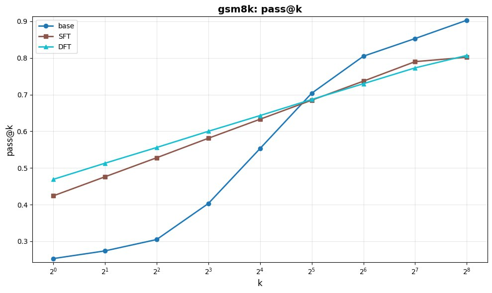
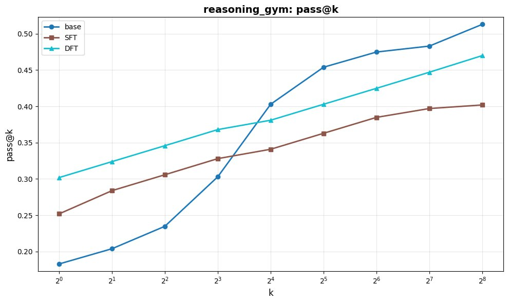

# Сравнение методов Alignment языковых моделей (SFT, DFT, GRPO)

## О проекте
Сравнительный анализ методов alignment для языковых моделей.
Дообучение Qwen2.5-1.5B на датасете математических задач GSM8K
методами SFT и DFT, а также анализ GRPO как RL-альтернативы.

## Методы
| Метод | Описание |
|-------|----------|
| **SFT** | Supervised Fine-Tuning — дообучение на парах вопрос-ответ |
| **DFT** | Direct Fine-Tuning — прямое дообучение с фильтрацией данных |
| **GRPO** | Group Relative Policy Optimization — RL-метод alignment |

## Результаты

### GSM8K — pass@k
| Метод | pass@1 | pass@8 | pass@256 |
|-------|--------|--------|----------|
| Base  | 0.25   | 0.30   | 0.90     |
| SFT   | 0.43   | 0.53   | 0.80     |
| DFT   | 0.47   | 0.55   | 0.80     |

### reasoning_gym — pass@k
| Метод | pass@1 | pass@8 | pass@256 |
|-------|--------|--------|----------|
| Base  | 0.18   | 0.24   | 0.51     |
| SFT   | 0.25   | 0.28   | 0.40     |
| DFT   | 0.30   | 0.33   | 0.47     |

**Ключевой вывод:** SFT/DFT повышают pass@1 на +88% (GSM8K),
но снижают разнообразие генерации при больших k — классический
alignment tax. Базовая модель обгоняет aligned-модели при k=256.

  

## Стек технологий
- **Модель:** Qwen2.5-1.5B
- **Фреймворки:** PyTorch, VERL, Transformers
- **Трекинг экспериментов:** ClearML, wandb
- **Данные:** GSM8K, reasoning_gym
